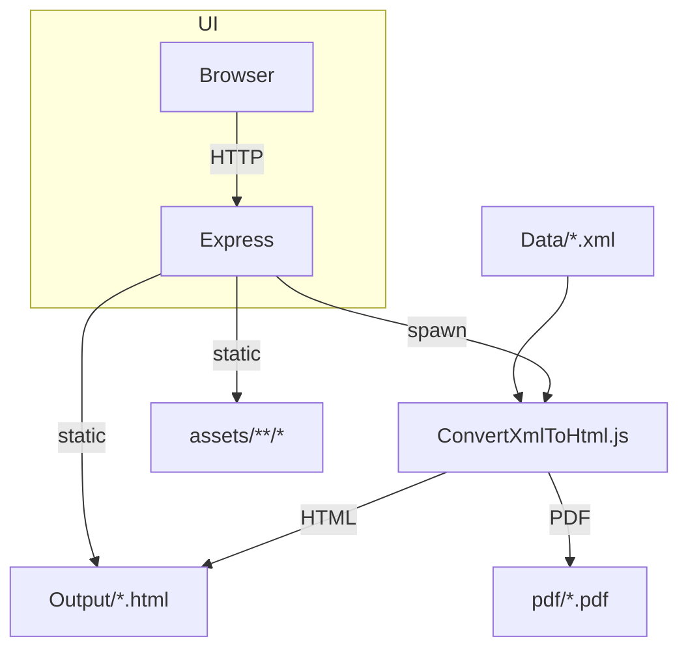

# 🏗️ Architecture Technique – OptimXmlPreview v2.0

> Ce document décrit la conception interne de l'application, les responsabilités de chaque module et les flux de données principaux.

## Sommaire

- [🏗️ Architecture Technique – OptimXmlPreview v2.0](#️-architecture-technique--optimxmlpreview-v20)
  - [Sommaire](#sommaire)
  - [Vue d'ensemble](#vue-densemble)
  - [Diagramme global](#diagramme-global)
  - [Modules](#modules)
  - [Flux de données](#flux-de-données)
  - [Points d'extension](#points-dextension)
  - [Qualités logicielles](#qualités-logicielles)

---

## Vue d'ensemble

OptimXmlPreview est une application **Node.js** mono-repo composée de :

- un **moteur de conversion** (script CLI) ;
- un **serveur Express** exposant l'API et l'interface web ;
- des **ressources statiques** (CSS/JS) totalement externalisées ;
- des **scripts Windows** facilitant l'intégration en environnement poste client.

Toutes les dépendances critiques (Express, xmldom, jsdom, Puppeteer) ont été vérifiées via **MCP context7** afin de garantir la conformité de leurs API.

---

## Diagramme global

---

## Modules

| Dossier/Fichier                   | Rôle                                     | Tech.                             | Dépendances                   |
| --------------------------------- | ---------------------------------------- | --------------------------------- | ----------------------------- |
| `src/convert/ConvertXmlToHtml.js` | Parsing XML, génération HTML, export PDF | Node 18, xmldom, jsdom, Puppeteer | `assets/templates/config.js`  |
| `server.js`                       | API REST & serveur statique              | Express 4, Multer                 | convertisseur (child_process) |
| `assets/css/`                     | Styles (email viewer, interface)         | CSS3                              | –                             |
| `assets/js/`                      | Logique navigation + search côté client  | Vanilla JS                        | fetch API                     |
| `assets/templates/config.js`      | Configuration unique                     | CommonJS                          | –                             |
| `utils/logger.js`                 | Logging coloré unifié                    | ANSI                              | –                             |

---

## Flux de données

1. **Upload** (`/api/upload-xml`)
   - Multer enregistre les fichiers dans `Data/`.
   - Express appelle le convertisseur via `child_process.spawn`.
2. **Conversion**
   - Le script lit les XML, extrait les métadonnées avec **xmldom**.
   - Génère un HTML propre avec JSDOM + CSS externe.
   - Optionnel : export PDF via Puppeteer.
3. **Index automatique**
   - Après conversion, un `index.html` est régénéré listant les derniers fichiers.
4. **Recherche** (`/api/search`)
   - Parcours les HTML dans `Output/` et calcule un score de pertinence.
5. **Affichage**
   - Le navigateur charge l'index, puis les fichiers HTML individuels.

---

## Points d'extension

- **Adaptation UI** : remplacer/étendre les fichiers CSS/JS dans `assets/`.
- **Formats supplémentaires** : ajouter une entrée dans `CONFIG.SUPPORTED_EXTENSIONS` + adapter `extractEmailMetadata`.
- **Dépannage CLI** : toutes les options sont dans `--help` du convertisseur.

---

## Qualités logicielles

| Qualité    | Mise en œuvre                                      |
| ---------- | -------------------------------------------------- |
| Modulaire  | Séparation claire Convertisseur / Serveur / UI     |
| Extensible | Configuration centralisée + hooks CLI              |
| Performant | Traitement par lots, usage stream/async I/O        |
| Testable   | Fonctions pures exportées, logs injectables        |
| Robustesse | Gestion d'erreurs try/catch + messages utilisateur |

---

*Document mis à jour : 2025-06-12*
