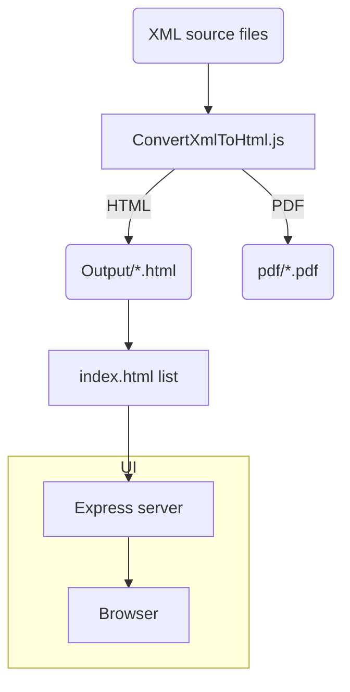

# ⚖️ OptimXmlPreview v2.0

Convertisseur open-source d'e-mails juridiques eBarreau/RPVA (XML) vers HTML & PDF, avec interface web, moteur de recherche plein-texte et API REST.

# Sommaire

- [⚖️ OptimXmlPreview v2.0](#️-optimxmlpreview-v20)
- [Sommaire](#sommaire)
  - [Fonctionnalités](#fonctionnalités)
  - [Installation Rapide](#installation-rapide)
  - [Usage](#usage)
    - [1️⃣ Interface Web](#1️⃣-interface-web)
    - [2️⃣ CLI](#2️⃣-cli)
    - [3️⃣ Upload direct via API](#3️⃣-upload-direct-via-api)
  - [Workflows de Conversion](#workflows-de-conversion)
  - [API REST](#api-rest)
  - [Configuration](#configuration)
  - [Structure du Projet](#structure-du-projet)
  - [Dépendances \& Références](#dépendances--références)
  - [Contribution](#contribution)
  - [Licence](#licence)

---

## Fonctionnalités

- Conversion **XML/XEML → HTML** avec mise en page responsive et branding personnalisé.
- Export **PDF** (Puppeteer) pour chaque e-mail converti.
- Envoi des pdf générés par email, individuellement ou par lot.
- **Interface web** (Express + vanilla JS) affichant la liste, la prévisualisation et un champ de recherche unifié.
- **Recherche plein-texte** (sujet, expéditeur, date, corps, pièces jointes).
- **API REST** (`/api/convert`, `/api/upload-xml`, `/api/status`, `/api/search`).
- **Scripts batch** (Windows) et **CLI Node** multiplateforme.

---

## Installation Rapide

```bash
# 1. Cloner
$ git clone https://github.com/<org>/OptimXmlPreview.git && cd OptimXmlPreview

# 2. Installer les dépendances
$ npm install

# 3. Lancer le serveur + interface (port 3000)
$ npm start
```

Windows 📦 : double-cliquez sur `OptimXmlPreview v2.0.bat` pour tout automatiser.

---

## Usage

### 1️⃣ Interface Web

1. Déposez vos fichiers `.xml` / `.xeml` dans `Data/` ;
2. Ouvrez <http://localhost:3000> ;
3. Cliquez sur « Convertir nouveaux e-mails ».

### 2️⃣ CLI

```bash
# Conversion par lot
$ node src/convert/ConvertXmlToHtml.js --input-dir ./Data --output ./Output

# Conversion d'un seul fichier
$ node src/convert/ConvertXmlToHtml.js --source-file ./Data/email.xml --output ./Output
```

### 3️⃣ Upload direct via API

```bash
POST /api/upload-xml
Content-Type: multipart/form-data (field "files[]")
```

---

## Workflows de Conversion



---

## API REST

| Méthode | Route                   | Corps                             | Réponse (succès)                              |
| ------- | ----------------------- | --------------------------------- | --------------------------------------------- |
| POST    | `/api/upload-xml`       | `multipart/form-data` (`files[]`) | `{success:true, converted:<n>}`               |
| POST    | `/api/convert`          | _(vide)_                          | `{success:true, details:{converted, errors}}` |
| GET     | `/api/status`           | –                                 | `{xmlFiles, htmlFiles, serverTime}`           |
| GET     | `/api/search?q=<terme>` | –                                 | `{results:[…], totalResults}`                 |

Voir `server.js` pour le détail des codes d'erreur.

---

## Configuration

Fichier central : `assets/templates/config.js`

```js
module.exports = {
  SUPPORTED_EXTENSIONS: ['.xml', '.xeml'],
  OUTPUT_FILE_EXTENSION: '.html',
  SERVER: { DEFAULT_PORT: 3000 },
  ASSETS: { CSS: { EMAIL_VIEWER: 'assets/css/email-viewer.css' } },
  // …
};
```

Variables d'environnement :

```
PORT=3000   # Port HTTP
NODE_ENV=production|development
```

---

## Structure du Projet

```text
OptimXmlPreview/
├─ assets/           # CSS / JS / templates
├─ Data/             # Entrée XML
├─ Output/           # Sortie HTML
├─ pdf/              # Exports PDF
├─ src/
│  └─ convert/       # Convertisseurs
│     └─ ConvertXmlToHtml.js
├─ server.js         # API & UI Express
└─ README.md
```

---

## Dépendances & Références

- **Express 4** – Framework HTTP minimaliste ([docs](https://expressjs.com))
- **xmldom 0.6** – Parsing XML DOM côté serveur.
- **jsdom 24** – Émulation DOM pour transformer le HTML.
- **Puppeteer 21** – Export PDF sans tête Chrome.

La liste complète est dans `package.json`. Les snippets officiels de ces librairies ont été obtenus via **MCP context7** pour valider les flux d'initialisation et de routing.

---

## Contribution

1. Fork → Branch feature → PR ;
2. `npm run lint && npm test` avant commit ;
3. Merci 💙 ! Voir `CONTRIBUTING.md`.

---

## Licence

MIT – © OptimXmlPreview Contributors.
